Cet article a d'abord été publié le 29 août 2020 sur [l'ancien blog](https://bloglegacy.insileco.io/2020/08/29/custom-tick-marks-with-rs-base-graphics-system/).
Nous pensons qu'il a été utile aux utilisateurs de R et avons décidé de revoir
son contenu et de le traduire en français sur notre nouveau blog.

## Contexte

Si vous utilisez le système graphique de base de R pour vos graphiques et que
vous aimez les personnaliser, vous vous êtes peut-être déjà demandé comment
personnaliser les graduations ! Je le fais assez souvent et je me suis dit
qu'il serait utile d'expliquer comment je procède. Considérons le graphique
suivant :

``` r
x_axis <- seq(0, 2, 0.1)
y_axis <- x_axis + .5 * rnorm(length(x_axis))
plot(x_axis, y_axis)
```

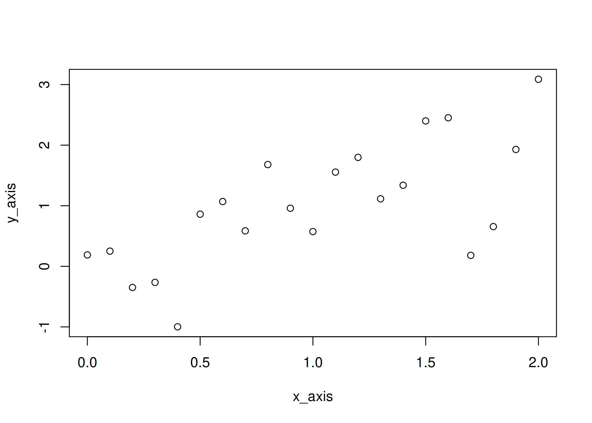

Par défaut, `plot.default` a sa propre manière de décider où les graduations
doivent être placées. C'est toujours un bon choix par défaut, mais parfois
ce n'est pas celui que vous recherchez. Heureusement, le package de base
`graphics` inclut tout ce dont vous avez besoin pour personnaliser les
graduations et donc, sans plus attendre, personnalisons nos graduations !

## Supprimer les axes et les rajouter

La première étape consiste à supprimer tous les axes. Il existe essentiellement
deux façons de procéder. Une option est d'utiliser `xaxt = "n"` et `yaxt = "n"`
pour supprimer sélectivement l'axe des x et l'axe des y, respectivement.

``` r
plot(x_axis, y_axis, xaxt = "n")
```

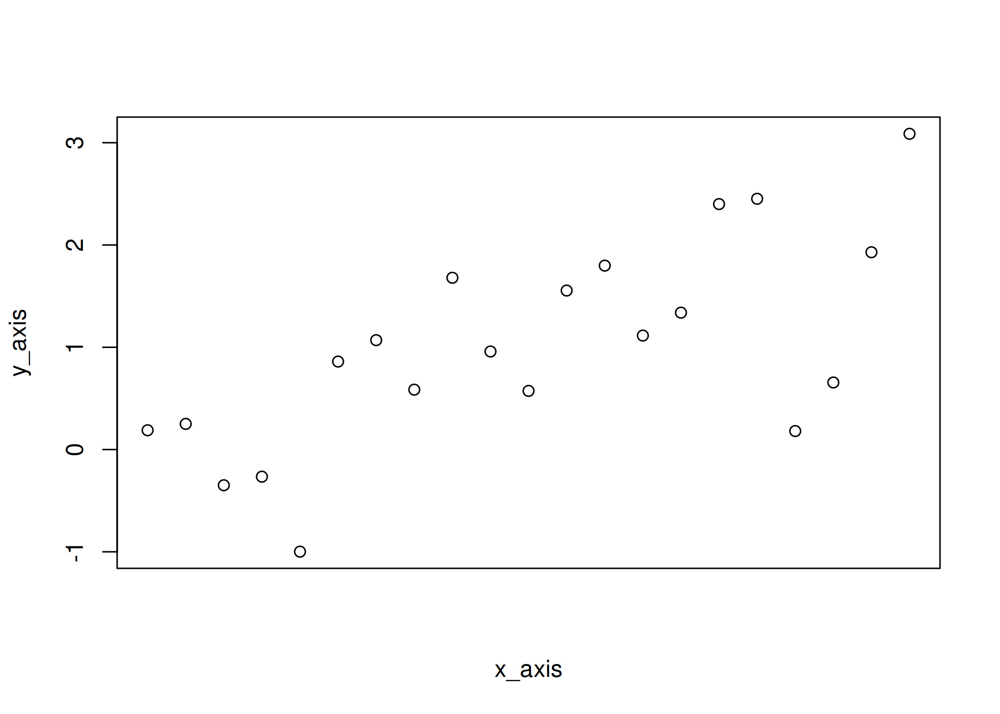

``` r
plot(x_axis, y_axis, xaxt = "n", yaxt = "n")
```


La deuxième option est de définir `axes` à `FALSE` dans `plot()` :

``` r
plot(x_axis, y_axis, axes = FALSE)
```

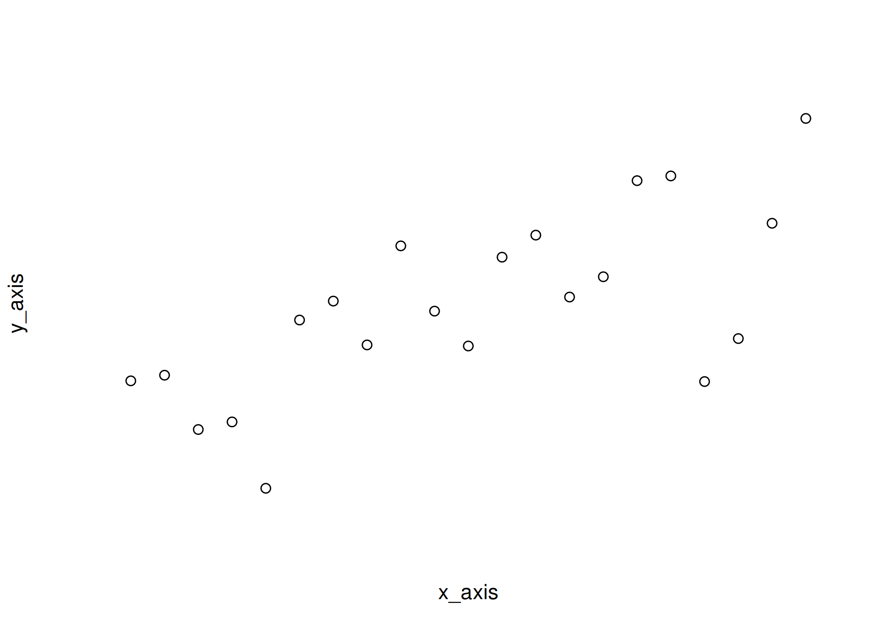

Comme vous pouvez le voir, lorsque `axes = FALSE`, le cadre est également
supprimé et vous pouvez en fait le rajouter avec `box()` :

``` r
plot(x_axis, y_axis, axes = FALSE)
box()
```


et changer son style, si désiré :

``` r
plot(x_axis, y_axis, axes = FALSE)
box(bty = "l")
```

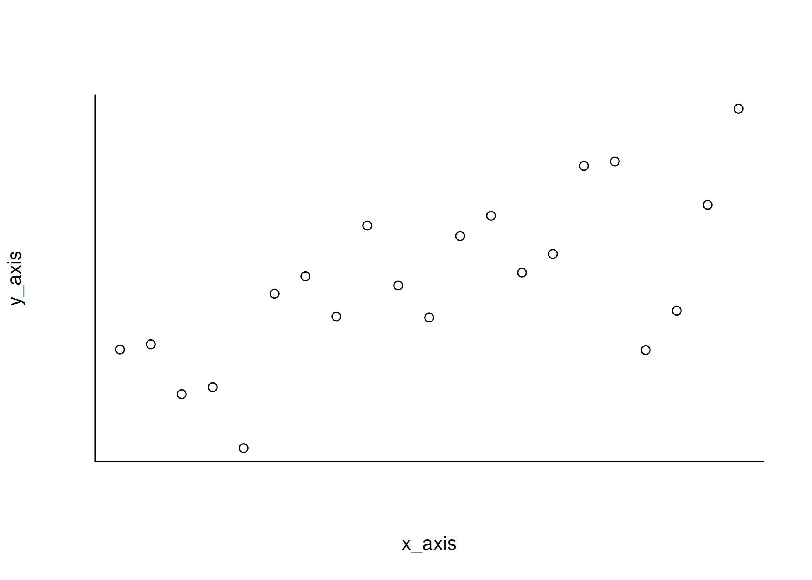

Cela dit, supprimons seulement l'axe des x pour le moment et ajoutons des
graduations à 0, 0.5, 1, 1.5 et 2 sur l'axe des x en utilisant `axis()` :

``` r
plot(x_axis, y_axis, xaxt = "n")
axis(1, at = seq(0, 2, .5))
```


Je peux facilement changer les étiquettes si les valeurs sur l'axe ne sont pas
celles qui devraient être affichées, par exemple :

``` r
plot(x_axis, y_axis, xaxt = "n")
axis(1, at = seq(0, 2, .5), labels = letters[1:5])
```

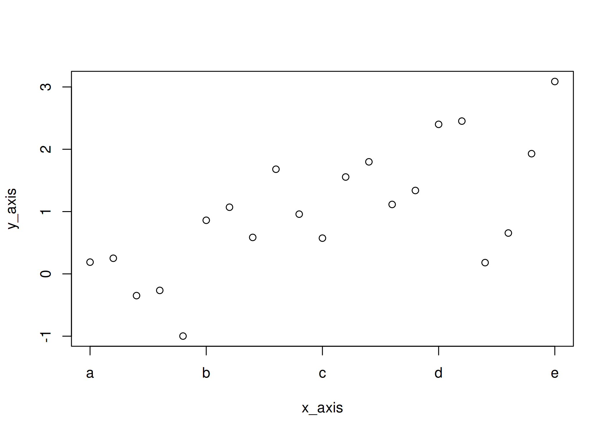

## Deuxième ensemble de graduations

Maintenant, ajoutons un deuxième ensemble de graduations ! Cela peut se faire
en appelant `axis()` une fois de plus.

``` r
plot(x_axis, y_axis, xaxt = "n")
axis(1, at = seq(0, 2, .5))
axis(1, at = setdiff(x_axis, seq(0, 2, .5)), labels = NA)
```

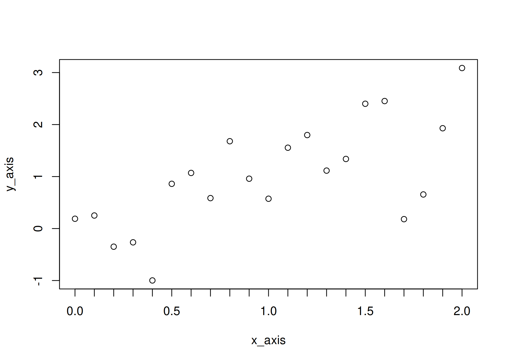

Comme vous l'avez peut-être remarqué, j'utilise `setdiff()` pour sélectionner
l'ensemble complémentaire de graduations. L'approche est simple : définir
toutes les positions de graduations avec `seq()` (ici avec un pas de 0.1),
définir les graduations principales, et utiliser `setdiff()` pour obtenir les
positions restantes. Comme ces graduations mineures n'ont pas besoin
d'étiquettes, je définis `labels = NA`.

## Supprimer la ligne supplémentaire

La principale raison pour laquelle j'ajuste les graduations sur mes graphiques
est d'éviter les lignes qui se superposent. `axis()` et `box()` dessinent tous
deux des lignes qui se chevauchent partiellement — c'est également vrai avec le
comportement par défaut de `plot()`. Les lignes qui accompagnent les graduations

``` r
plot(x_axis, y_axis, axes = FALSE)
axis(2)
axis(1, at = seq(0, 2, .5), labels = seq(0, 2, .5))
axis(1, at = setdiff(x_axis, seq(0, 2, .5)), labels = NA)
```

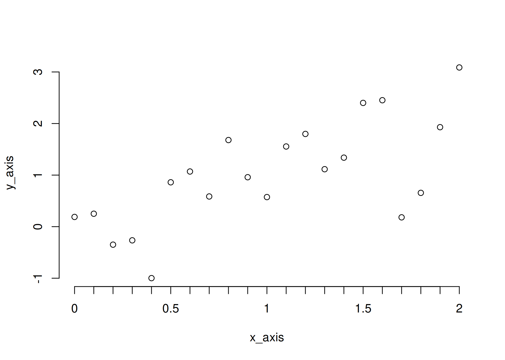

se superposent avec le cadre

``` r
plot(x_axis, y_axis, axes = FALSE)
box()
```


Cela peut souvent passer inaperçu, mais personnellement j'ai tendance à
remarquer ces superpositions et ça m'agace... Quoi qu'il en soit, une façon de
gérer cela est de définir l'épaisseur de ligne à 0 dans `axis()`.

``` r
plot(x_axis, y_axis, xaxt = "n")
axis(1, at = seq(0, 2, .5), labels = seq(0, 2, .5), lwd = 0)
axis(1, at = setdiff(x_axis, seq(0, 2, .5)), labels = NA, lwd = 0)
```

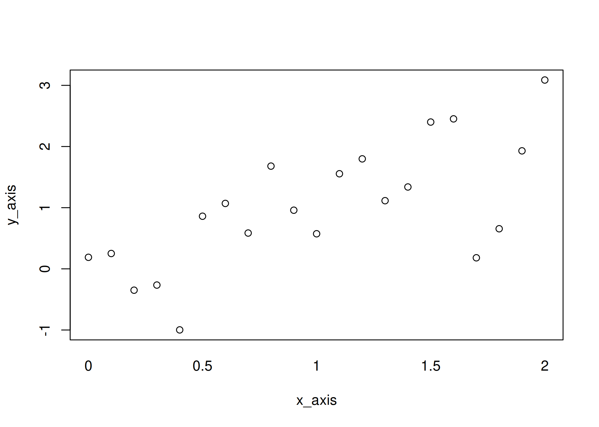

puis de définir l'épaisseur de ligne des graduations, contrôlée par
`lwd.ticks`, à une valeur supérieure à 0

``` r
plot(x_axis, y_axis, xaxt = "n")
axis(1, at = seq(0, 2, .5), labels = seq(0, 2, .5), lwd = 0, lwd.ticks = 1)
axis(1, at = setdiff(x_axis, seq(0, 2, .5)), labels = NA, lwd = NA, lwd.ticks = 1)
box()
```


Notez que si vous souhaitez uniquement supprimer les graduations, vous pouvez
utiliser `tick = FALSE`.

``` r
plot(x_axis, y_axis, xaxt = "n")
axis(1, at = seq(0, 2, .5), labels = seq(0, 2, .5), tick = FALSE)
axis(1, at = setdiff(x_axis, seq(0, 2, .5)), labels = NA, tick = FALSE)
box()
```


Mais si vous voulez simplement vous débarrasser de la ligne supplémentaire,
mais pas des graduations, alors vous devez définir `lwd` à 0 et `lwd.ticks`
à une valeur positive.

## Personnaliser les graduations

Après avoir effectué les étapes ci-dessus, vous avez peut-être réalisé
qu'ajuster finement `lwd.ticks` est un bon moyen de personnaliser vos
graduations !

``` r
plot(x_axis, y_axis, xaxt = "n")
axis(1, at = seq(0, 2, .5), labels = seq(0, 2, .5), lwd = 0, lwd.ticks = 1.5)
axis(1, at = setdiff(x_axis, seq(0, 2, .5)), labels = NA, lwd = 0, lwd.ticks = .5)
box()
```


Un deuxième paramètre pour personnaliser davantage les graduations est `tck`,
qui appartient à `par()`

``` r
par(tck = -0.07)
plot(x_axis, y_axis, xaxt = "n")
axis(1,
  at = seq(0, 2, .5), labels = seq(0, 2, .5), lwd = 0,
  lwd.ticks = 1
)
axis(1, at = setdiff(x_axis, seq(0, 2, .5)), labels = NA, lwd.ticks = 1)
box()
```

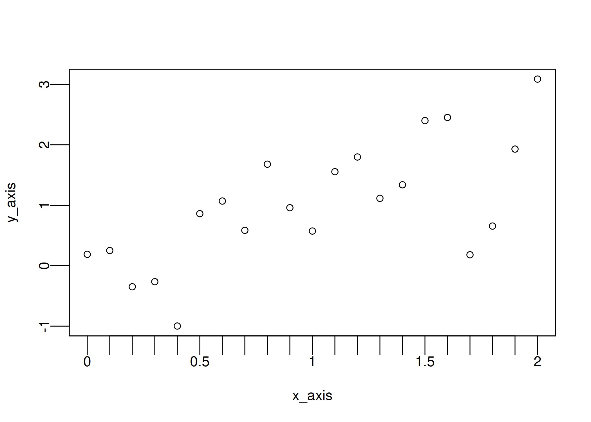

mais peut également être utilisé avec `axis()` grâce aux points de suspension
(`...`), ce qui me permet de le changer uniquement pour un ensemble de
graduations

``` r
plot(x_axis, y_axis, xaxt = "n")
axis(1,
  at = seq(0, 2, .5), labels = seq(0, 2, .5), lwd = 0, tck = -0.07,
  lwd.ticks = 1
)
axis(1, at = setdiff(x_axis, seq(0, 2, .5)), labels = NA, lwd.ticks = 1)
box()
```

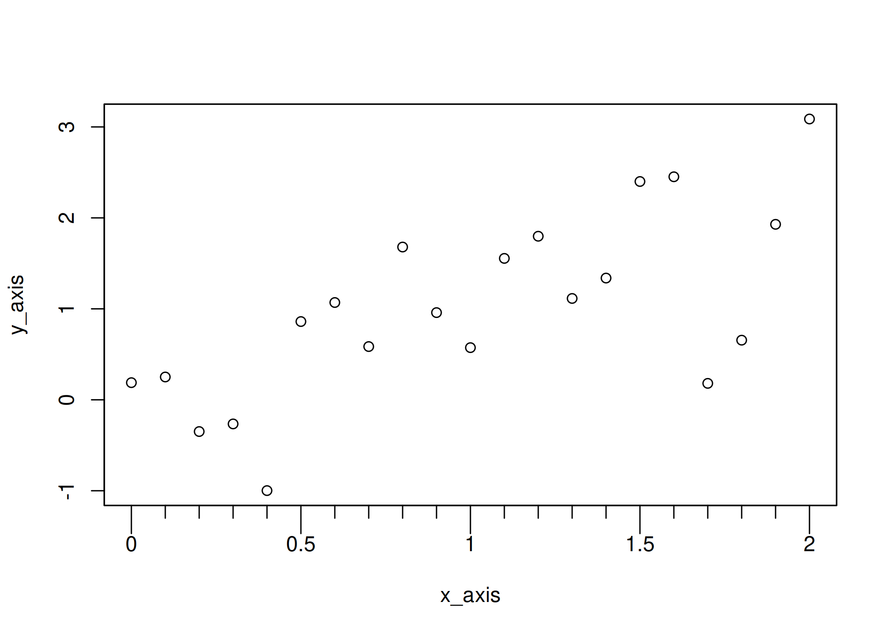

De plus, en utilisant une valeur positive, vous pouvez faire pointer les
graduations vers l'intérieur !

``` r
plot(x_axis, y_axis, xaxt = "n")
axis(1,
  at = seq(0, 2, .5), labels = seq(0, 2, .5), lwd = 0, tck = 0.07,
  lwd.ticks = 1
)
axis(1, at = setdiff(x_axis, seq(0, 2, .5)), labels = NA, lwd.ticks = 1)
box()
```


Et finalement, vous pouvez modifier de nombreux aspects, y compris leur couleur
et leur type de ligne :

``` r
plot(x_axis, y_axis, xaxt = "n")
axis(1, at = seq(0, 2, .5), labels = seq(0, 2, .5), lwd = 0, lwd.ticks = 1.5, tck = -.07, col = 2, lty = 2)
axis(1, at = setdiff(x_axis, seq(0, 2, .5)), labels = NA, lwd.ticks = .5, tck = -.03, col = 3)
box()
```

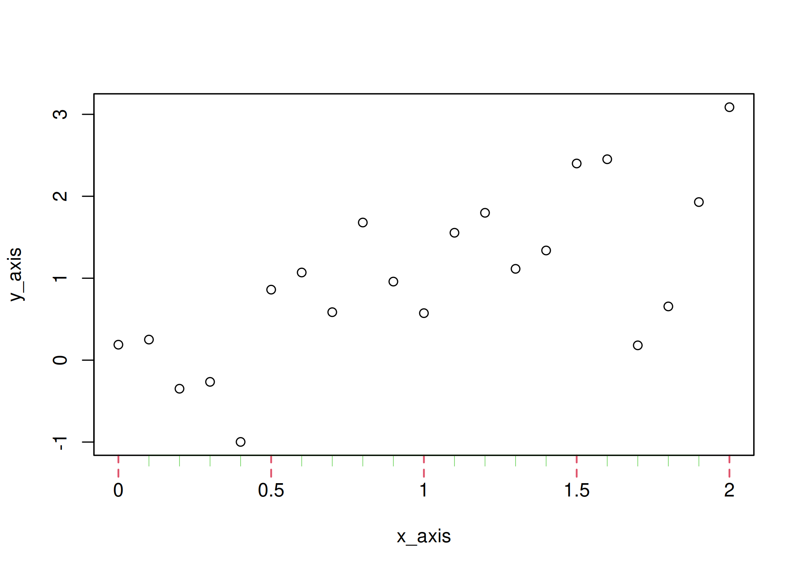

Une dernière astuce : si vous devez ajuster la position des graduations, vous
devrez utiliser `mgp` (également documenté dans `par`), qui est un vecteur de
trois éléments contrôlant les caractéristiques suivantes :

1.  la position des étiquettes d'axe,
2.  la position des étiquettes de graduations,
3.  la position des graduations.

``` r
par(mgp = c(2.5, 1.6, 0))
plot(x_axis, y_axis, xaxt = "n")
axis(1,
  at = seq(0, 2, .5), labels = seq(0, 2, .5), lwd = 0, lwd.ticks = 1.5,
  tck = -.1, col = 2, lty = 2
)
axis(1, at = setdiff(x_axis, seq(0, 2, .5)), labels = NA, lwd.ticks = .5, tck = -.03, col = 3)
box()
```

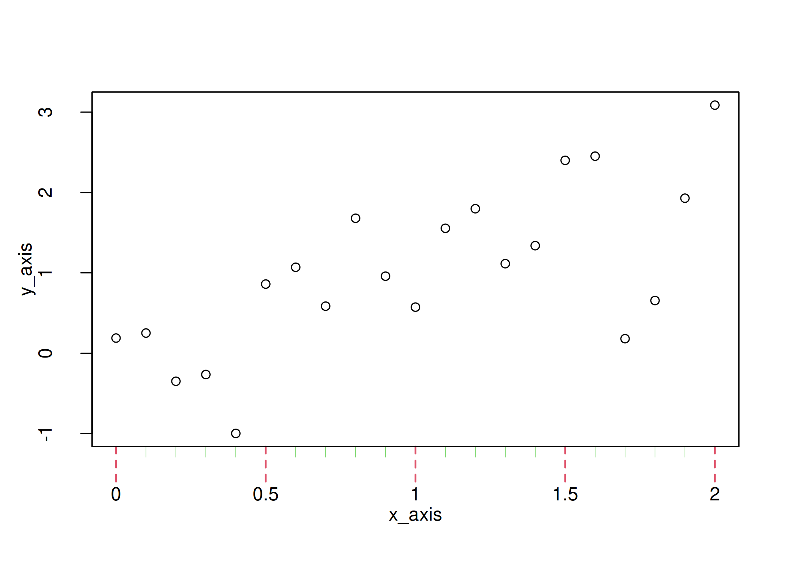

Notez que, tout comme pour `tck`, je peux utiliser `mgp` dans `axis()`. Dans
cet exemple, cela n'affectera pas les étiquettes d'axe car elles ont été
ajoutées par `plot()`.

``` r
plot(x_axis, y_axis, xaxt = "n")
axis(1,
  at = seq(0, 2, .5), labels = seq(0, 2, .5), lwd = 0, lwd.ticks = 1.5,
  tck = -.1, col = 2, lty = 2
)
axis(1, at = setdiff(x_axis, seq(0, 2, .5)), labels = NA, lwd.ticks = .5, tck = -.03, col = 3, mgp = c(2.5, 1.6, 0))
box()
```


## Tout rassembler dans une fonction

Toutes les étapes ci-dessus peuvent sembler complexes au début. Mais une fois
que vous serez à l'aise, vous réaliserez que la plupart des graphiques
nécessitent d'ajuster les mêmes paramètres, et vous pourrez les encapsuler
dans une fonction qui répond à vos besoins. Par exemple, j'utilise souvent
une fonction similaire à celle ci-dessous :

``` r
myaxis <- function(side, all, main, lab = main, col1 = 1, col2 = 1, ...) {
  axis(side, at = main, labels = lab, lwd = 0, lwd.ticks = 1, col = col1, ...)
  axis(side,
    at = setdiff(all, main), labels = NA, lwd.ticks = .75, tck = -.025,
    col = col2, ...
  )
}
```

qui rend essentiellement la personnalisation des graduations très facile !

``` r
plot(x_axis, y_axis, xaxt = "n", yaxt = "n")
myaxis(1, x_axis, seq(0, 2, .5))
myaxis(2, seq(-0.5, 2.8, .1), seq(-0.5, 2.5, .5), las = 1)
```

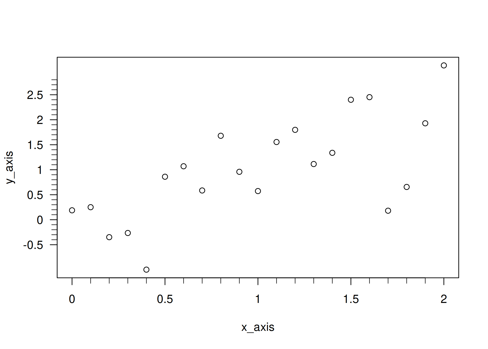

## Et ggplot2 ?

Vous vous demandez peut-être pourquoi cet article se concentre sur les
graphiques de base plutôt que sur ggplot2. La personnalisation des graduations
dans ggplot2 est bien documentée ailleurs, nous recommandons donc les ressources
suivantes :

- [Annotation log
  ticks](https://tidyverse.github.io/ggplot2-docs/reference/annotation_logticks.html)
- [ggplot2 axis ticks: a guide to customize tick marks and
  labels](https://www.sthda.com/english/wiki/ggplot2-axis-ticks-a-guide-to-customize-tick-marks-and-labels#change-the-appearance-of-the-axis-tick-mark-labels)

## Informations de session

Ceci fournit les informations sous lesquelles l'article a été rendu.

``` r
sessionInfo()
```

    R version 4.5.2 (2025-10-31)
    Platform: x86_64-pc-linux-gnu
    Running under: Ubuntu 25.10

    Matrix products: default
    BLAS:   /usr/lib/x86_64-linux-gnu/blas/libblas.so.3.12.1
    LAPACK: /usr/lib/x86_64-linux-gnu/lapack/liblapack.so.3.12.1;  LAPACK version 3.12.0

    locale:
     [1] LC_CTYPE=en_US.UTF-8       LC_NUMERIC=C
     [3] LC_TIME=en_US.UTF-8        LC_COLLATE=en_US.UTF-8
     [5] LC_MONETARY=en_US.UTF-8    LC_MESSAGES=en_US.UTF-8
     [7] LC_PAPER=en_US.UTF-8       LC_NAME=C
     [9] LC_ADDRESS=C               LC_TELEPHONE=C
    [11] LC_MEASUREMENT=en_US.UTF-8 LC_IDENTIFICATION=C

    time zone: America/New_York
    tzcode source: system (glibc)

    attached base packages:
    [1] stats     graphics  grDevices datasets  utils     methods   base

    loaded via a namespace (and not attached):
     [1] vctrs_0.7.1         cli_3.6.5           knitr_1.51
     [4] rlang_1.1.7         xfun_0.56           otel_0.2.0
     [7] processx_3.8.6      targets_1.11.4      jsonlite_2.0.0
    [10] data.table_1.18.2.1 glue_1.8.0          prettyunits_1.2.0
    [13] backports_1.5.0     htmltools_0.5.9     ps_1.9.1
    [16] rmarkdown_2.30      evaluate_1.0.5      tibble_3.3.1
    [19] fastmap_1.2.0       base64url_1.4       yaml_2.3.12
    [22] lifecycle_1.0.5     compiler_4.5.2      codetools_0.2-20
    [25] igraph_2.2.1        pkgconfig_2.0.3     digest_0.6.39
    [28] R6_2.6.1            tidyselect_1.2.1    pillar_1.11.1
    [31] callr_3.7.6         magrittr_2.0.4      tools_4.5.2
    [34] secretbase_1.1.1    bspm_0.5.7
